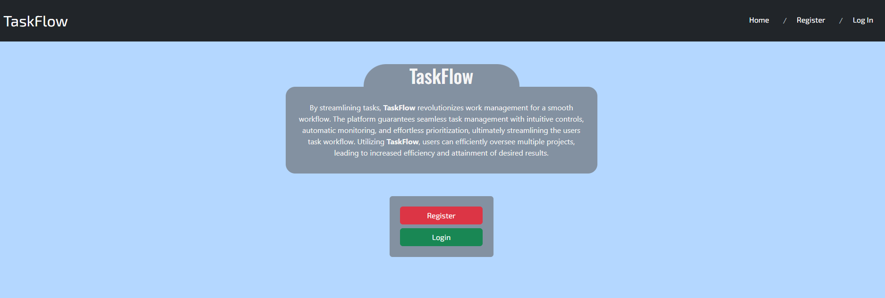
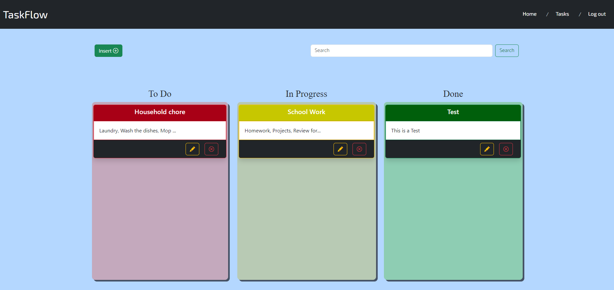

# TaskFlow
TaskFlow is a web application built from **[SpringBoot](https://spring.io/projects/spring-boot) MVC**. 

## User Interface



## Requirements:
>- Java 17 or later
>- Maven 3.5+
>- PostgreSQL
>- Visual Studio Code 

*Make to sure install Spring Boot extension pack and PostgreSQL extension for Visual Studio Code.*


## Initialization
1. Clone this repository.
2. Setup *application.properties* file.
```
spring.datasource.url=
spring.datasource.username=
spring.datasource.password=
spring.datasource.driver-class-name=org.postgresql.Driver
spring.jpa.hibernate.ddl-auto=update

spring.jpa.show-sql=true
```

* Save the file inside the resources folder


**For more information in the setup, follow [Teddy Smith guide](https://www.youtube.com/watch?v=VqptK6_icjk&list=PL82C6-O4XrHejlASdecIsroNEbZFYo_X1) for the Spring Boot and Database Setup.**

3. Run the web application using the Spring Boot Extension.
4. Open a browser and visit the link http://localhost:8080.

